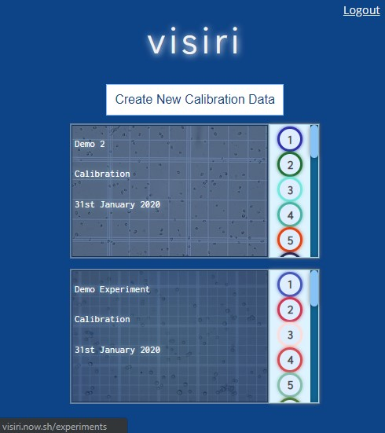
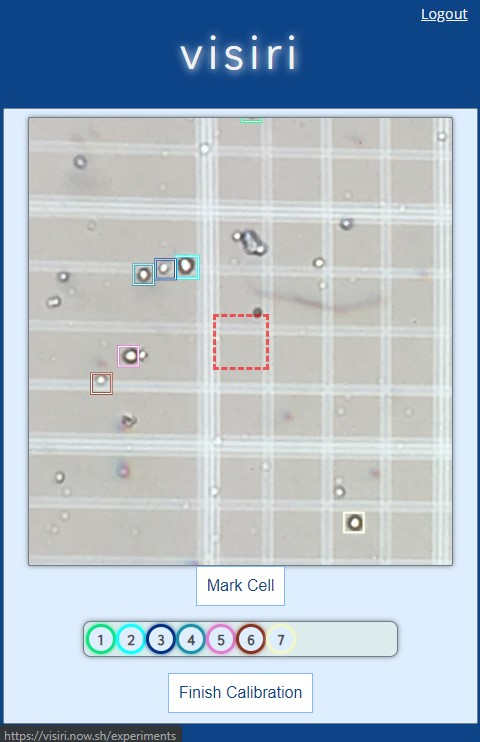

# Visiri - Automated Cell Counter and Image Markup Tool


- Live Page: [Live](https://visiri.now.sh/)
- Server API endpoint (deployed on Heroku): [Server Status](https://infinite-brushlands-69470.herokuapp.com/api/)
- API Server Repository: [Server](https://github.com/zkhin/visiri-server)
- Client Repository: [Client](https://github.com/zkhin/visiri-client)
___

## About Project

Visiri is an application that allows users to upload cell microscopy images and create datasets that will allow deep learning
models to automatically count cells.

Using a mobile device camera linked to the eyepiece of a microscope, a neural network must be trained with user's laboratory-specific imaging equipment and cells in order for automated counting to work.

This project is actively being developed in stages with the first being the frontend and data storage architectures for generating these calibration datasets.

In this current build, users can upload images of their cells and label the cells in a mobile-friendly browser-based interface. Intuitive manipulation of image zoom and panning is important to workflow and Visiri supports touch events such as pinch zooming and dragging as well as desktop mouse/wheel events.

The next build will establish the convolutional neural network models and deploying GPU-based architecture for training/prediction and task scheduling.
___
## Technologies Used

Client deployed on Zeit

- React
- JavaScript
- Konva (HTML5 Canvas rendering)
- HTML
- CSS

API Server deployed on Heroku

- Express
- Node
- PostgreSQL
- JWT Auth

---

## Account Demo Login

Important Note: Uploaded images other than provided samples will be cleared from AWS S3 bucket every few hours.
```
Username: demo

Password: password
```
---

## Screenshots

### Experiments Page



### Upload/Markup Page



#### How-to:

- Upload an image
- Use mouse or touch to position the red square on top of cells
- Scale the image with mouse-wheel or pinch to fit cell
- Click 'Mark Cell' or doubleclick/tap
- Click on colored circles to re-center previously marked areas
- Click 'Finish Calibration'
---

Copyright © 2020 Zayar Khin / Visiri
